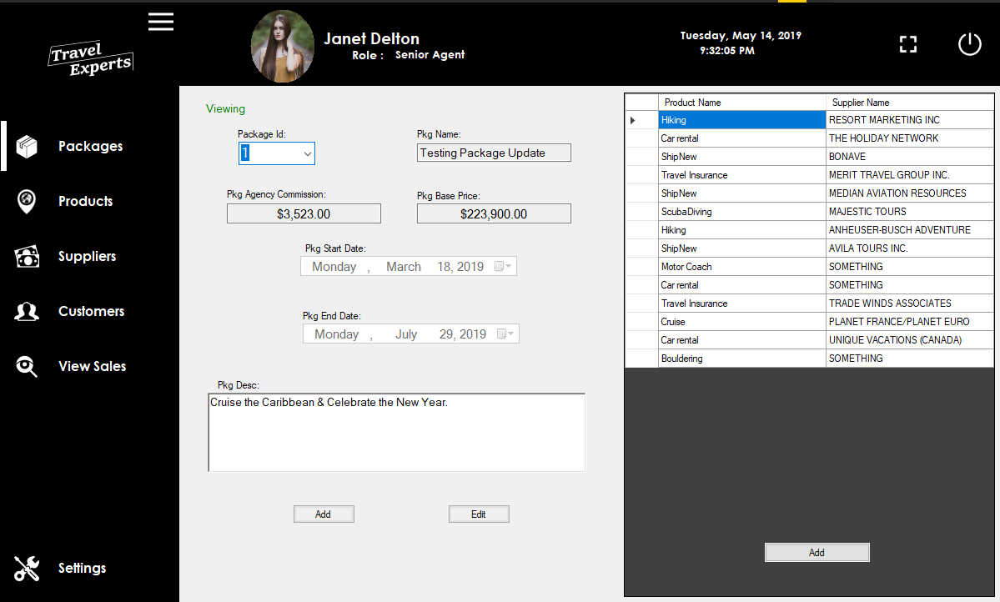

# C# Desktop App for TravelExperts Database Management
> With the main requirement regarding multitasking and user friendly UI/UX design

### Contributors
[ericT135](https://github.com/ericT135) | [LimingHong](https://github.com/LimingHong) | [guidoamaya](https://github.com/guidoamaya) 

## Project Overview:

## Software and Tech stack used:
* Visual Studio 2019 16.1
* Microsoft SQL Server Management Studio 2017 (SSMS)
* Windows 10

## Description:
This application allows agents to register  and login in order to manage travel packages, products and suppliers informations.

## Development Setup and Deployment:
    * Installation of SSMS 2017
    * Installation of Visual Studio 2019
    * Reconfigure "connectionString" in TravelExpertsClassLib -> TravelExpertsDB.cs to "...@"Data Source=localhost\[YourServerName]..."

## Developmental Time Frame
* Mar 21th 2019 to  Apr 11th 2019
* Total: 21 days

